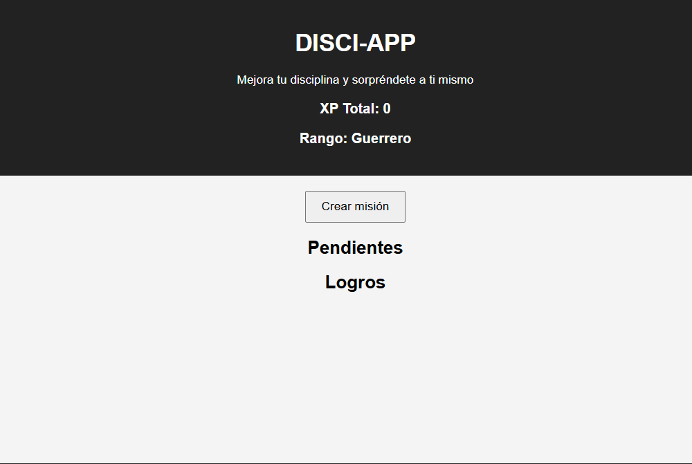
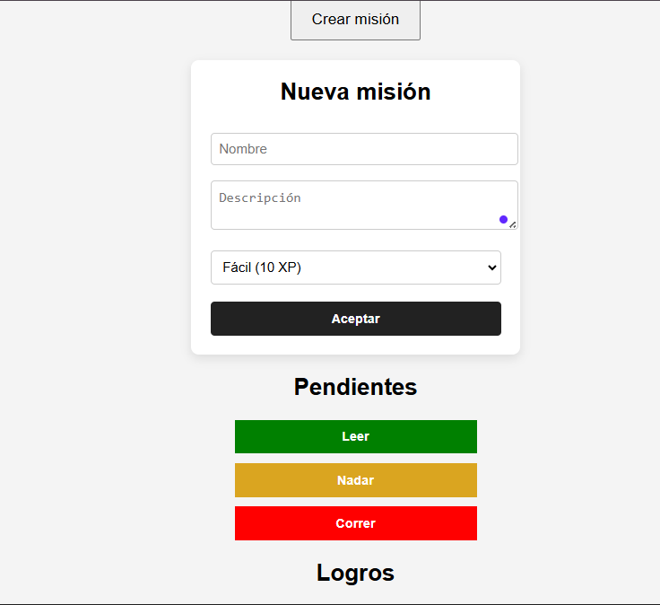
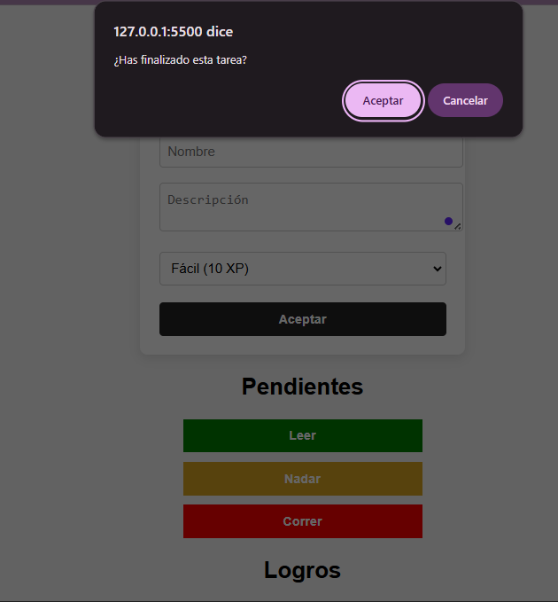
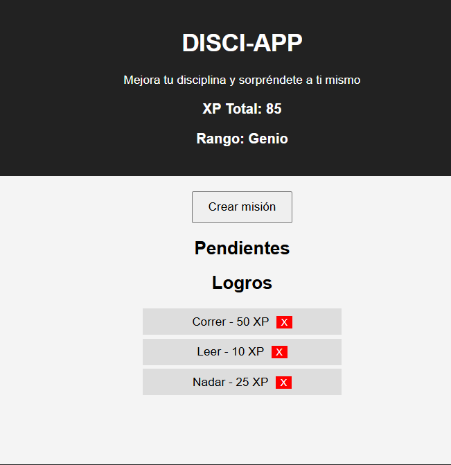
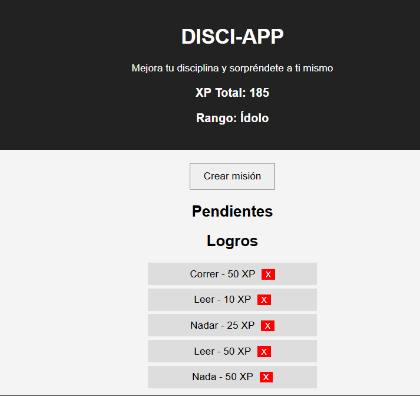

# DISCI-APP 🎮
## "Mejora tu disciplina y sorpréndete a ti mismo"

---

## 📌 Descripción del Laboratorio

Este proyecto fue desarrollado como parte del **Laboratorio #4** del curso **Sistemas y Tecnologías Web** en la Universidad del Valle de Guatemala.

El objetivo del laboratorio es aplicar el concepto de **Gamification**, creando una aplicación web que permita reforzar hábitos mediante un sistema de misiones y recompensas utilizando únicamente:

- HTML
- CSS
- JavaScript puro

No se utilizaron librerías ni frameworks externos.

---

## 🎯 Objetivo de la Aplicación

DISCI-APP permite al usuario:

- Crear misiones con nombre, descripción y dificultad.
- Asignar XP según la dificultad.
- Acumular XP global.
- Subir de rango según la experiencia obtenida.
- Registrar cuando una misión es completada.
- Visualizar misiones pendientes y logros obtenidos.

---

## 🧠 Sistema de XP

| Dificultad | XP |
|------------|----|
| Fácil      | 10 |
| Normal     | 25 |
| Difícil    | 50 |

---

## 🏆 Sistema de Rangos

- 0 – 59 XP → **Guerrero**
- 60 – 149 XP → **Genio**
- 150+ XP → **Ídolo**

---

## 📂 Estructura del Proyecto

```
LAB4INTROJAVASCRIPT/
│
├── src/
│   ├── CSS/
│   │   └── styles.css
│   │
│   ├── HTML/
│   │   └── Index.html
│   │
│   └── JS/
│       └── script.js
│
├── .gitignore
└── README.md
```

---

## ⚙️ Guía de Instalación y Ejecución

1. Clonar el repositorio:

```
git clone <LINK_DEL_REPOSITORIO>
```

2. Abrir la carpeta del proyecto.

3. Navegar a:

```
src/HTML/
```

4. Abrir el archivo `Index.html` en el navegador.

No se requiere instalación de dependencias.

---

## 🚀 Funcionalidades Implementadas

✔ Crear misión con nombre, descripción y dificultad  
✔ Asignación automática de XP  
✔ XP global acumulativo  
✔ Actualización automática de rango  
✔ Confirmación al completar misión  
✔ Cambio de estado a "SUCCESSFUL"  
✔ Visualización de logros  
✔ Eliminación de logros completados  
✔ Uso de console.log para validación de estructura  

---

## 🖥️ Capturas de Pantalla

### 📍 Pantalla Principal



---

### 📍 Creación de Misión




---

### 📍 Misiones Pendientes




---

### 📍 Logros y XP Actualizado



---

## 🎥 Video Demostrativo

Link del video mostrando el funcionamiento completo de la aplicación:

👉 **(Agregar link del video aquí)**

---

## 📚 Tecnologías Utilizadas

- HTML5
- CSS3
- JavaScript (Vanilla JS)

---

## 👨‍💻 Autor

Nombre del estudiante: *José Rivera*  
Curso: Sistemas y Tecnologías Web  
Docente: Marlon Fuentes  
Semestre: 1, 2026  

---

## 📌 Observaciones

Este proyecto cumple con los requerimientos del laboratorio, incluyendo:

- Uso exclusivo de HTML, CSS y JavaScript puro.
- Estructura organizada del repositorio.
- Uso adecuado de Git con múltiples commits relevantes.
